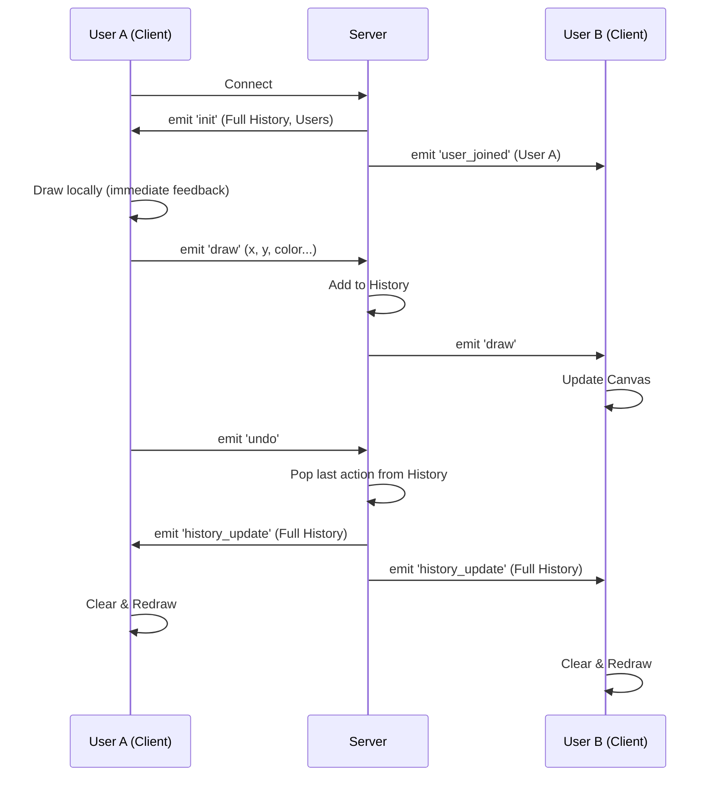

# Architecture

## Data Flow Diagram

## WebSocket Protocol

### Client -> Server

| Event | Data | Description |
|-------|------|-------------|
| `draw` | `{ type, x, y, w, h, text, ... }` | A drawing action. Can be freehand segment or shape (rect, circle, text). |
| `cursor_move` | `{ x, y }` | Current mouse position (throttled). |
| `undo` | `null` | Request to undo the last global action. |
| `clear` | `null` | Request to clear the entire canvas. |

### Server -> Client

| Event | Data | Description |
|-------|------|-------------|
| `init` | `{ history: [], users: [] }` | Sent on connection with full state. |
| `draw` | `{ type, x, y, ... }` | Broadcast of a new drawing action (stroke or shape). |
| `cursor_update` | `{ id, x, y, color }` | Broadcast of another user's cursor position. |
| `history_update` | `[ ...actions ]` | Full history replacement (after undo). |
| `clear` | `null` | Notification to clear canvas local state. |
| `user_joined` | `{ id, color }` | Notification of a new user. |

## Undo/Redo Strategy

We implemented a **Global History Replay** strategy.
- **Why?** It ensures perfect consistency across all clients. Managing distributed undo stacks with conflict resolution is error-prone.
- **How?** The server maintains a linear list of all operations. When an undo occurs, `history.pop()` happens on the server, and the *new result state* is broadcast to all clients. Clients verify state by clearing their canvas and replaying the history list.

## Performance Decisions

1.  **Cursor Overlay Canvas**:
    - We use two `<canvas>` elements stacked on top of each other.
    - `#drawing-canvas`: Contains the persistent drawing. Only updated on `draw` events.
    - `#cursor-canvas`: Contains volatile cursors. Cleared and redrawn frequently (every mouse move).
    - **Benefit**: Moving a cursor does not require repainting the complex drawing history, saving massive CPU/GPU resources.

2.  **Event Throttling**:
    - `mousemove` events fire every ~16ms. Sending packets this fast would choke the network.
    - We throttle `cursor_move` emits to ~20ms (client-side) and use `socket.broadcast.volatile` (server-side) to allow dropping packets during congestion.

3.  **Quadratic Curves vs Line Segments**:
    - For this initial version, we use line segments for network simplicity. However, the client uses `lineCap: 'round'` and `lineJoin: 'round'` to smooth transitions.
    - *Improvement*: Sending control points for quadratic bezier curves would send fewer packets for smoother lines.

## Conflict Resolution

Our conflict resolution strategy is **Server Authority with Atomicity**.
- The server processes events sequentially.
- If two users draw at the exact same millisecond, Node.js event loop processes one first. that one gets added to history index N, and the next to N+1.
- Because we broadcast the *result* (or the atomic action), all clients converge on the same visual state.
